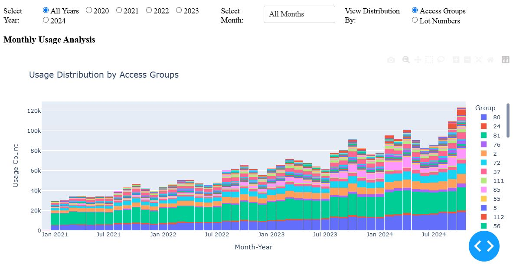
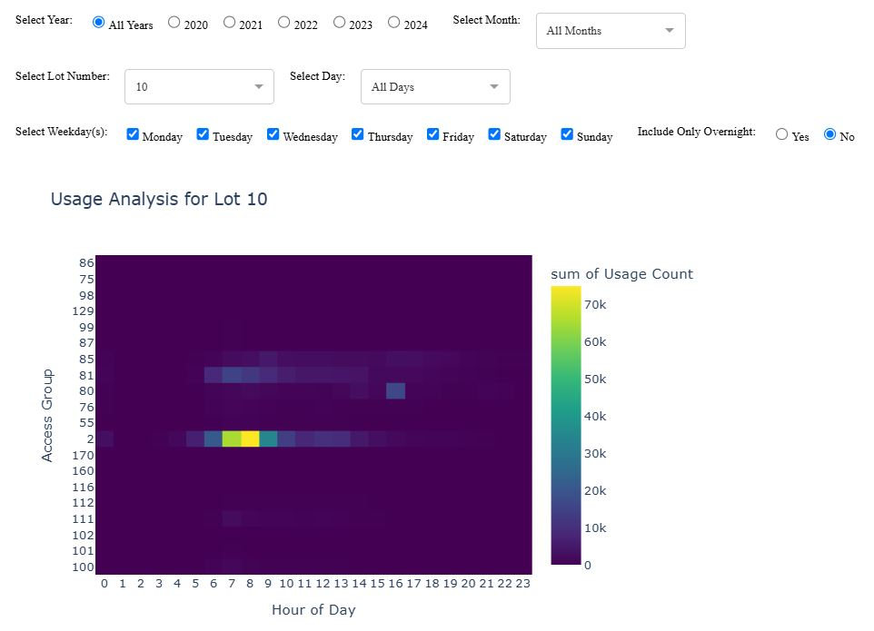
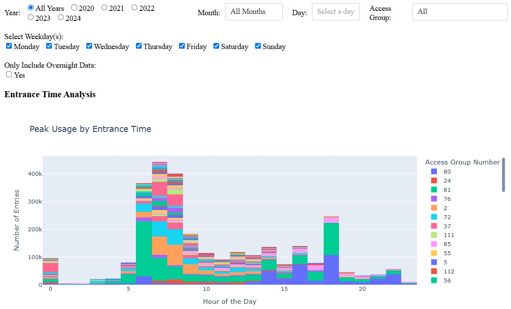
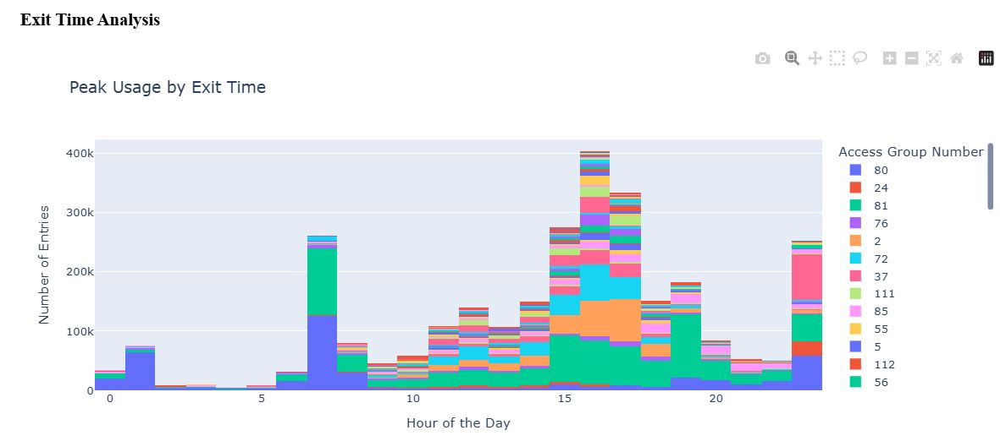
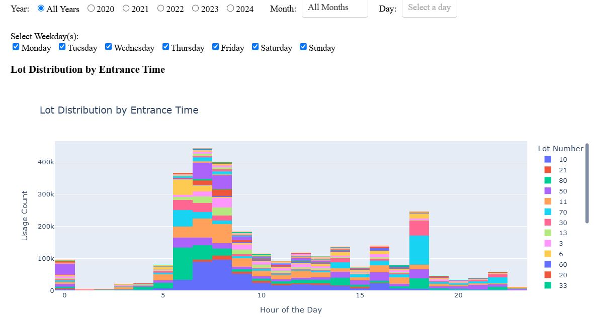
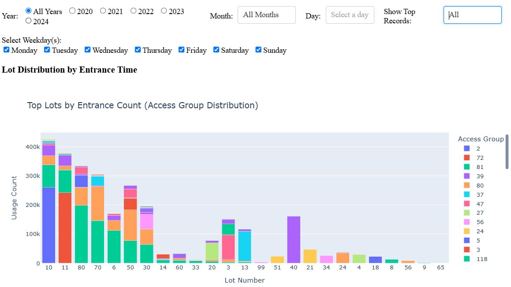
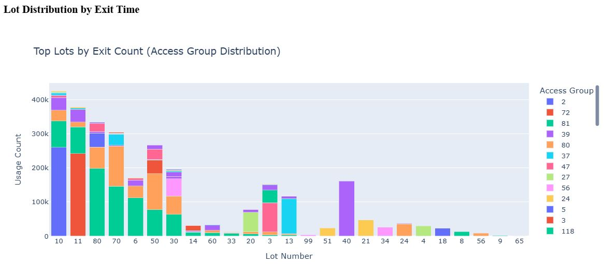
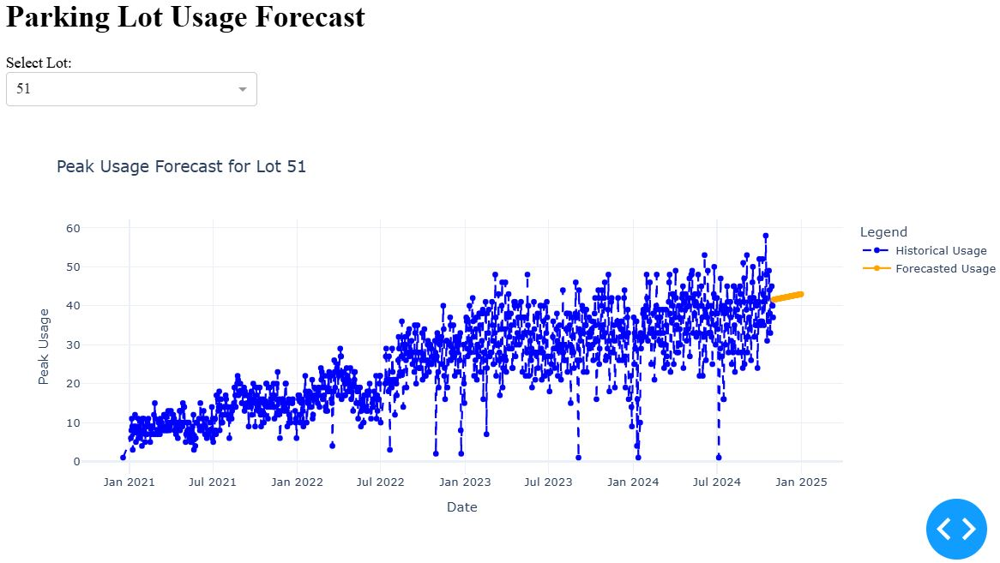

# DS-project-ParkingLot
### Instructions:
1. Download the notebook in the same folder where the following two data files are present:
	- CardAccessGroupAssignment.csv
	- CardTransaction.csv
2. Make sure to download the necessary packages for Dash and Plotly before running the notebook
	```
	pip install dash
	pip install jupyter-dash
	pip install plotly
	pip install scikit-learn
	```
3. Run one cell at a time, instead of running all the cells
4. Note that the internal links in the table of content are not working due to a possible [bug](https://github.com/jupyter/notebook/discussions/7418#diag)
5. There are 5 different interactive dashboard consists of 9 visualizations:
	- #### <ins>Monthly Usage Analysis</ins>
	<kbd></kbd>
	
	---
	- #### <ins>Usage Analysis by Lot, Access Group, and Hour of Day</ins>
	<kbd></kbd>

	---
	- #### <ins>Access Group Usage Analysis</ins>
	<kbd></kbd>
	<kbd></kbd>
	---
	
	- #### <ins>Lot Number Usage Analysis</ins>
	<kbd></kbd>
	<kbd></kbd>
	---
	
	<kbd></kbd>
	<kbd></kbd>
	---
	
	- #### <ins>Forecast for November and December 2024</ins></kbd>
	<kbd>