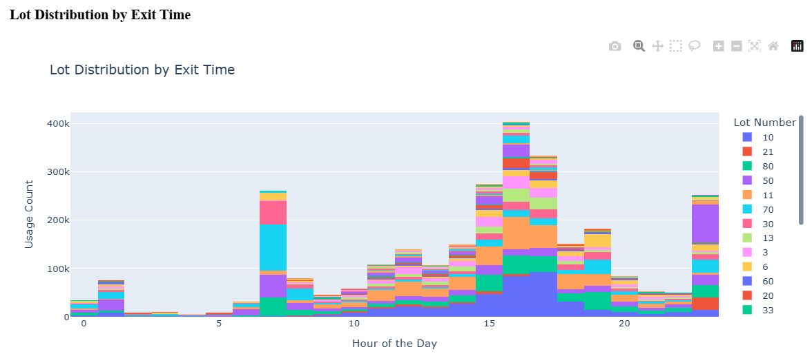

# DS-project-ParkingLot

This notebook utilizes parking lot usage data from the University of Iowa's Parking and Transportation Department, covering the past four years. It features various interactive visualizations designed for analysis and pattern identification. Additionally, it includes a visualization of forecasted data. Note that this notebook does not include *Exploratory Data Analysis (EDA)*.

### Instructions:
1. Download the notebook in the same folder where the following two data files are present:
	- CardAccessGroupAssignment.csv
	- CardTransaction.csv
2. Make sure to download the necessary packages for Dash and Plotly before running the notebook.
	```
	pip install dash
	pip install jupyter-dash
	pip install plotly
	pip install scikit-learn
	```
3. Run one cell at a time, instead of running all the cells at once. Running all the cells using 'Run All Cells' may cause an error. 
4. Note that a visualization may take up to 10 seconds to show up.
5. Also, note that the internal links in the table of contents are not working due to a possible [bug](https://github.com/jupyter/notebook/discussions/7418#diag) with Jupyter Notebook 7.
6. Below are the screenshots of the visualizations. There are 5 different interactive dashboards in the notebook. In total there are 9 visualizations.
	- #### <ins>Monthly Usage Analysis</ins>
	<kbd></kbd>
	
	---
	- #### <ins>Usage Analysis by Lot, Access Group, and Hour of Day</ins>
	<kbd></kbd>

	---
	- #### <ins>Access Group Usage Analysis</ins>
	<kbd></kbd>
	<kbd></kbd>
	
	---
	
	- #### <ins>Lot Number Usage Analysis</ins>
	<kbd></kbd>
	<kbd></kbd>
	
	---
	
	<kbd></kbd>
	<kbd></kbd>
	
	---
	
	- #### <ins>Forecast for November and December 2024</ins></kbd>
	**Linear regression** model is used for forecasting the data for November and December 2024.
	<kbd>